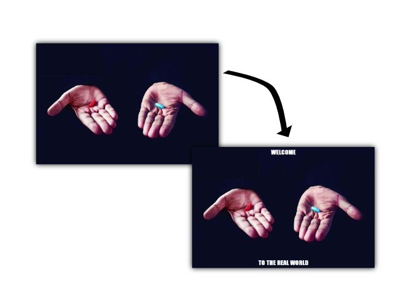

# meme-generator-cli
Meme Generator written in .NET

## Sample usage
```
MemeGenerator.exe --image "./pic.jpg" --top "Welcome" --out meme.jpg --size 24 --bottom "to the real world" --color "#ffffff"
```
<p align="center">
    
</p>

## All arguments
Input file
```
--image <filepath>
-i
--image "./image.jpg"

```
Output file
```
--out <filepath>
-o
--output "./output_image.jpg"
```

Text on the top of image
```
--top <string>
-t
--top "Welcome"
```

Text on the bottom of image
```
--bottom <string>
-b
--bottom "to the real world"
```

Size of the font (in px)
```
--size <number>
-s
--size 24
```

Color of the font (in hex)
```
--color <hex color string>
-c
--color "#ffffff"
```
